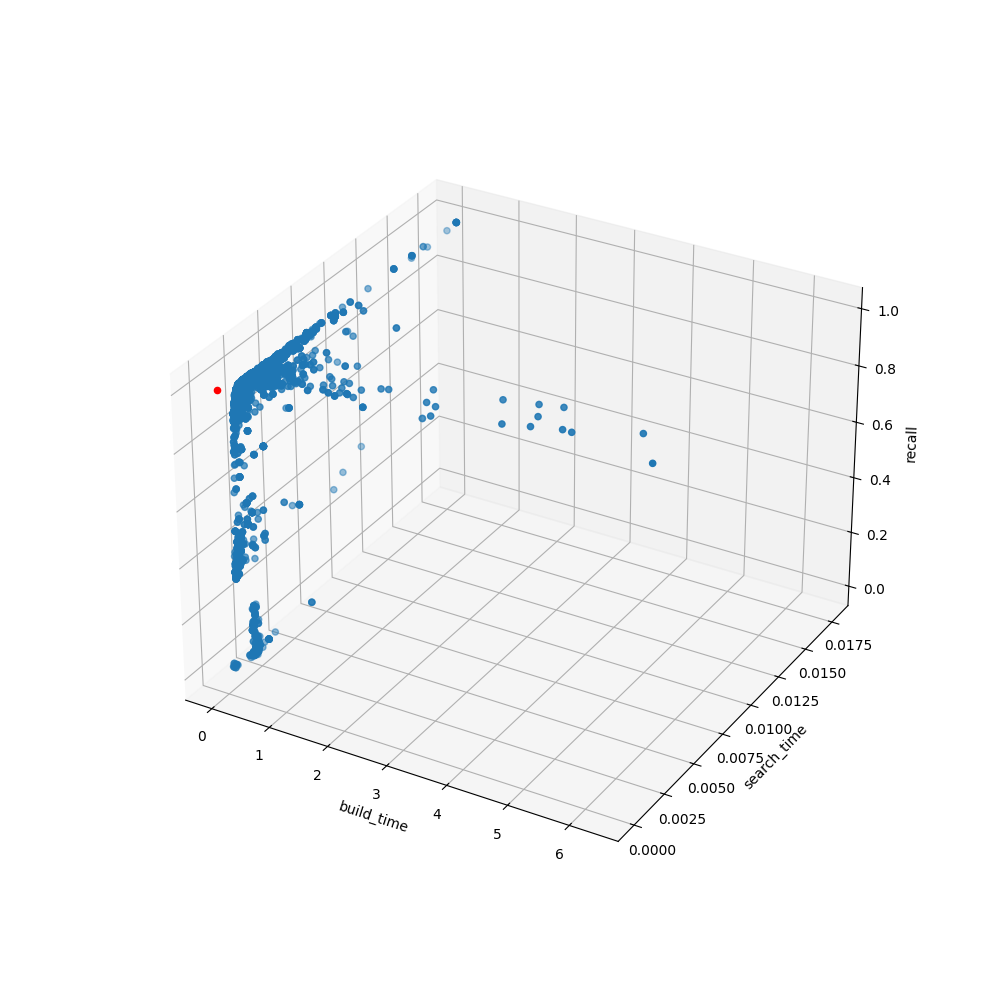
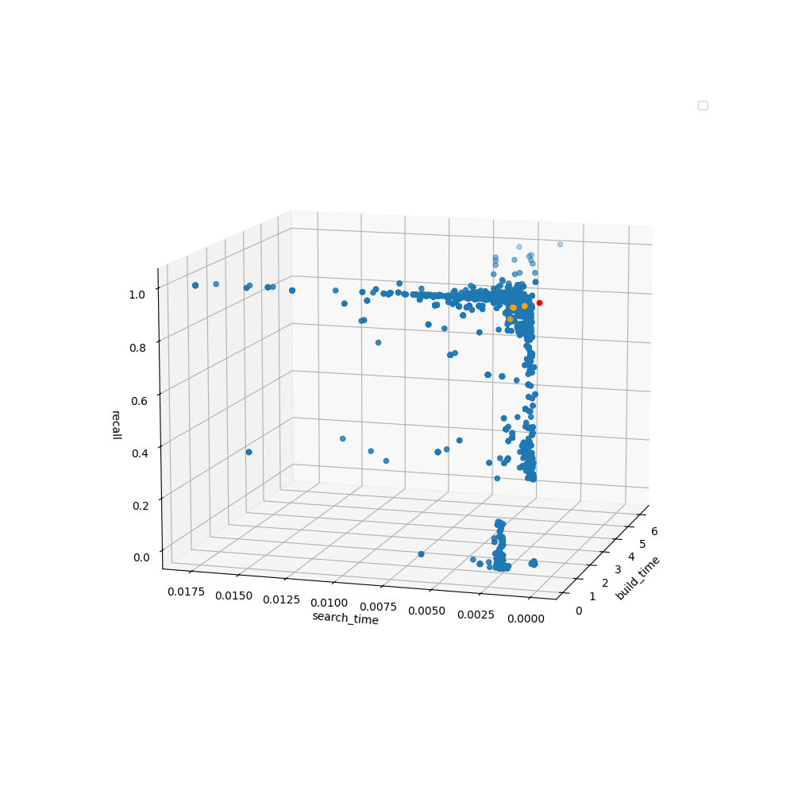

# Fixing the Problem Statement

The problem statement in the project proposal/milestone 1 was not so clear so let me rephrase it here. Namely, let me define and model my problem as follows. First, we have the following decision variables:

$$
\begin{aligned}
    M &= \text{Number of neighbors a vertex is allowed to have} \\
    C &= \text{Candidate set size during construction} \\
    S &= \text{Candidate set size during search} \\
    \alpha &= \text{Closeness threshold}
\end{aligned}
$$

These are the hyper-parameters of the algorithm that I am working with now called Vamana (or DiskANN, depending on the paper) which creates a proximity graph where each vertex represents a vector in a point set $P$. In short, there are two main phases to this algorithm:

- **Construction.** During construction, Vamana incrementally constructs the proximity graph by storing at most $C$ candidates of the neighbor of the new point while traversing through the existing graph looking for a good place to put the new point. Then, it chooses at most $M$ points from the candidates by using $\alpha$ to decided if a candidate is close enough to the new point or far enough from each other or not.
- **Search.** During search, Vamana stores a collection of candidate points of size at most $S$. These candidates are of the $k$-nearest neighbors of a queried point.

Note that this is different from in the proposal. In the proposal, I mentioned an algorithm called HNSW that uses a parameter to be some sort of probability normalizing factor but does not use $\alpha$. However, I've decided to remove it now that I've looked at the code base again. With the currently available HNSW implementations (`hnswlib`, FAISS, and CMUParlay), there is no way of modifying this parameter. Realistically, I also can't implement HNSW with the time constraint as well. Thus, I decided that only focusing on DiskANN (which uses the parameters above) would be a better choice since optimizing the hyper-parameters for HNSW would just be a _subset_ of DiskANN. Additionally, we will apply the following constraints:

$$
\begin{aligned}
    &1 \leq M \leq 1024, & M \in \mathbb{Z} \\
    &100 \leq C \leq 1024, & C \in \mathbb{Z} \\
    &100 \leq S \leq 1024, & S \in \mathbb{Z} \\
    &1 \leq \alpha < 2, &\alpha \in \mathbb{R}
\end{aligned}
$$

The reason $C$ and $S$ are constrained to be at least 100 is because the data set I have searches for 100 nearest neighbors so you would at least need that many candidates. The rest are up to the constraints of the Vamana code base.

In terms of programming, this will be stored as a vector of 4 binary strings (called $bp$ for build parameters), each with length of 10 bits. When generating the new population, we can just apply crossover on each of the strings separately.

Now, let me clarify the objective functions. I have the following objective functions that I will optimize for in a multi-objective setting:

$$
\begin{aligned}
    f_c(bp) &= \text{Time taken for constructing the graph, to minimize} \\
    f_m(bp) &= \text{Memory needed to store the graph, to minimize} \\
    f_s(bp) &= \text{Time taken to search the queries in total, to minimize} \\
    f_r(bp) &= \text{Quality of the search results, to maximize}
\end{aligned}
$$

Putting everything together, we have the following model:

$$
\begin{aligned}
    \min_{bp \in BP} &\left(f_c(bp), f_m(bp), f_s(bp), \frac{1}{f_r(bp)}\right) \\
    \text{s.t.} \qquad
        &1 \leq M \leq 1024, & M \in \mathbb{Z} \\
        &100 \leq C \leq 1024, & C \in \mathbb{Z} \\
        &100 \leq S \leq 1024, & S \in \mathbb{Z} \\
        &1 \leq \alpha < 2, &\alpha \in \mathbb{R}
\end{aligned}
$$

# (Rough) Effects of the Hyper-parameters on the Objective Functions

Here are some rough observations I've seen from experiments before and during this class:

- $M$ (max degree) by itself does not effect $f_c$ (construction time) much but higher $M$ leads to higher $f_m$ (memory usage) and $f_s$ (search time) which is bad but also increases $f_r$ (search quality) which is good
- $C$ (max number candidates during construction) by itself only affects $f_c$ (construction time) where when $C$ increases, $f_c$ also increases
- $S$ (max number of candidates during search) by itself cannot affect $f_c$ nor $f_m$ at all since it is the only hyper-parameter not used during construction but higher $S$ leads to higher $f_s$ (search time) but also higher $f_r$ (search quality)
- $\alpha$ (closeness threshold) by itself does not affect anything except for $f_r$ but its relationship is not as clear but in theory, it should improve $f_r$ (search quality) since it makes sure that the search done on the graph explores a good chunk of the graph

# Progress Update

## Implementation

Right now, I have an implementation of NSGA-II that works. Here are a few details of the implementation:

- As mentioned before, each decision variable is stored as a 10-bit string which can represent integers between 0-1024
  - For $M$, we just need to make sure that it never becomes 0 so we can just use an if-else statement
  - For $C$ and $S$, we actually constrain it to only between 0-924 since we lower-bound it at 100 then we can add 100 to it when we get the value to use as build parameters
  - For $\alpha$, since it is constrained between $[1, 2)$, it is simply scaled down to be $1 + (x/1025)$ where $x \in [0, 1024]$ is the integer stored as a string
- $P_0$ is generated by randomizing an integer within the constraints
- The only crossover method I have right now is cut-catenate of the strings where mutation is still a bit flip
  - During crossover, the parents are uniformly and randomly chosen since I still haven't decided the existing methods that we know wouldn't work (and I still haven't done HW5)

Note that there is still no Bayesian optimization yet, just NSGA-II, but I think I will just use [this package](https://github.com/bayesian-optimization/BayesianOptimization) for BO.

## Preliminary Results

Please note that due to the small size of the data set used for this part (10K points of 128-dimension vector), the size of the index stored in memory is too small for the tools I use to detect so it will be ignored for now. That is, $f_m$ will be ignored for now. Thus, our problem simplifies down to only 3 objective functions:

$$
\begin{aligned}
    \min_{bp \in BP} &\left(f_c(bp), f_s(bp), \frac{1}{f_r(bp)}\right) \\
    \text{s.t.} \qquad
        &1 \leq M \leq 1024, & M \in \mathbb{Z} \\
        &100 \leq C \leq 1024, & C \in \mathbb{Z} \\
        &100 \leq S \leq 1024, & S \in \mathbb{Z} \\
        &1 \leq \alpha < 2, &\alpha \in \mathbb{R}
\end{aligned}
$$

In Figure 1, although not so clear due to the density of points, we can see that there is definitely a pareto front in the top left corner of the plot which is where the graph constructed has the highest recall (search quality), lowest build time, and lowest search time. Observe that this has some distance away from the (impossible) "_perfect_" case where it has perfect recall and spends no time building and searching. What's left for me (at least for now) is to identify the hyper-parameters that caused these.

Specifically for Figure 1, I used a population size of 50 individuals and ran for 100 generations. The result shown here is from a single run (it takes around 45 minutes for a single run while also burning my CPU down so I can't run it multiple times in parallel like I do in the homework).

For now, I will define the _best_ parameter to be the point whose Euclidian distance to the _perfect_ point is minimum---essentially where the following _weighted squared sum_.

$$
  WS(bp) = \frac{1}{6}f_b(bp)^2 + \frac{2}{6}f_s(bp)^2 + \frac{3}{6}(f_r(bp)-1)^2
$$

The logic for this is pretty much that we give the most priority to search accuracy (recall or $f_r$), then responsiveness (search time or $f_s$), then construction time ($f_c$). We can do a simple exhaustive linear search for this. Here are the top 10s:

|     | Gen | $M$ | $C$ | $S$ | $\alpha$ | Build    | Search   | Recall | $WS$     |
| :-- | :-- | :-- | :-- | :-- | :------- | :------- | :------- | :----- | :------- |
| 0   | 22  | 1   | 121 | 113 | 1.628906 | 0.031291 | 0.001461 | 0.9333 | 0.014330 |
| 1   | 38  | 5   | 101 | 697 | 1.089844 | 0.126652 | 0.001413 | 0.9732 | 0.018200 |
| 2   | 39  | 5   | 101 | 697 | 1.089844 | 0.126652 | 0.001413 | 0.9732 | 0.018200 |
| 3   | 40  | 5   | 101 | 697 | 1.089844 | 0.126652 | 0.001413 | 0.9732 | 0.018200 |
| 4   | 32  | 5   | 101 | 644 | 1.125977 | 0.126631 | 0.001357 | 0.9726 | 0.018291 |
| 5   | 33  | 5   | 101 | 644 | 1.125977 | 0.126631 | 0.001357 | 0.9726 | 0.018291 |
| 6   | 34  | 5   | 101 | 644 | 1.125977 | 0.126631 | 0.001357 | 0.9726 | 0.018291 |
| 7   | 35  | 5   | 101 | 644 | 1.125977 | 0.126631 | 0.001357 | 0.9726 | 0.018291 |
| 8   | 89  | 7   | 101 | 226 | 1.014648 | 0.131558 | 0.000819 | 0.9805 | 0.018450 |
| 9   | 90  | 7   | 101 | 226 | 1.014648 | 0.131558 | 0.000819 | 0.9805 | 0.018450 |

Note that Build and Search refers to the time it takes in seconds and $WS$ is the $WS$ shown above.

## Discussion

Interestingly, the hyper-parameters that has the best weighted sum value is when $M=1$, which is when the graph is essentially connected into a line (the graph built by Vamana is a directed graph so this is possible). I hypothesize that since a part of the algorithm makes it so that once the neighborhood of a vertex is filled, it just moves on which to the next vertex which would explain the low build time. However, it does have a significantly worse Recall compared to the rest.

Another interesting observation is that all _good_ $M$'s are less than 10. I've mostly used these algorithms to play with larger data sets (with 1M data points, mainly so I can go do something else while I wait for it to run) where _good_ $M$'s for those data sets would be around 100-200. One more interesting observation is how different the $S$'s are since the top one is when $S$=113, then the subsequent ones are when $S$ is approximately 650-700, then winds down to 226. This also seems to correlate with the values of $\alpha$. Notice also that Recall is essentially sorted in reverse. I suppose that you really need to sacrifice speed for accuracy.

One thing that is consistent among the top individuals is that $C$ is around 100 (with the outlier being the top rank at 121). While no concrete conclusion can be drawn here, I think that I should stick with $C \approx 100$ from now on.

Finally, let us have a look at the (rotated) 3D plot of the three objective functions for every single individual to have existed, the top 10s, and the perfect point.

